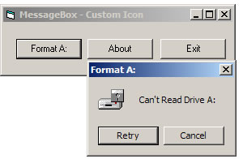



## MessageBox with Icon

### Description

This hsows how to add an Icon to a messagebox from a resource file, No more Bitblt, Subclassing, All code is in the model and uses on API call, very easy to understand to. anyway hope you like it, Testsed on Windows 2000 and XP
 
### More Info
 

             |
---                |---
**Submitted On**   |2007-12-27 23:00:02
**By**             |[dreamvb](https://github.com/Planet-Source-Code/PSCIndex/blob/master/ByAuthor/dreamvb.md)
**Level**          |Beginner
**User Rating**    |4.3 (13 globes from 3 users)
**Compatibility**  |VB 5\.0, VB 6\.0
**Category**       |[Coding Standards](https://github.com/Planet-Source-Code/PSCIndex/blob/master/ByCategory/coding-standards__1-43.md)
**World**          |[Visual Basic](https://github.com/Planet-Source-Code/PSCIndex/blob/master/ByWorld/visual-basic.md)
**Archive File**   |[MessageBox20953512272007\.zip](https://github.com/Planet-Source-Code/dreamvb-messagebox-with-icon__1-69821/archive/master.zip)

